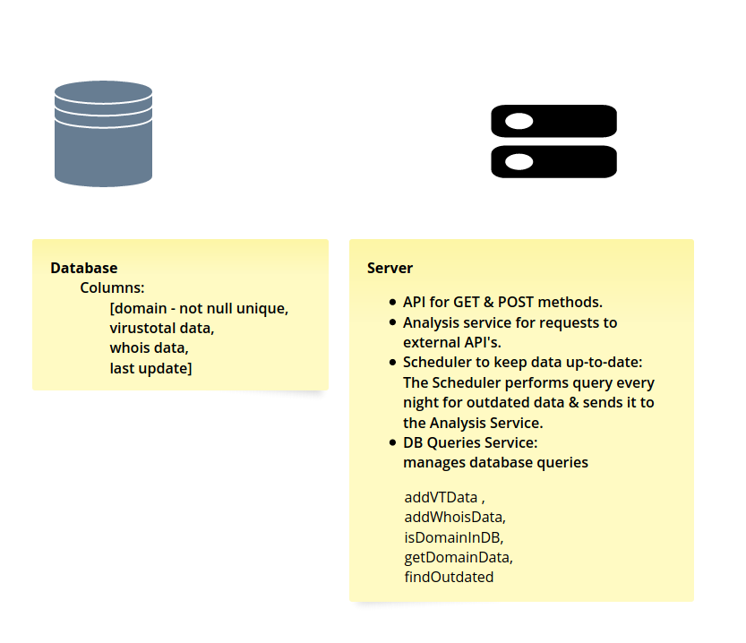
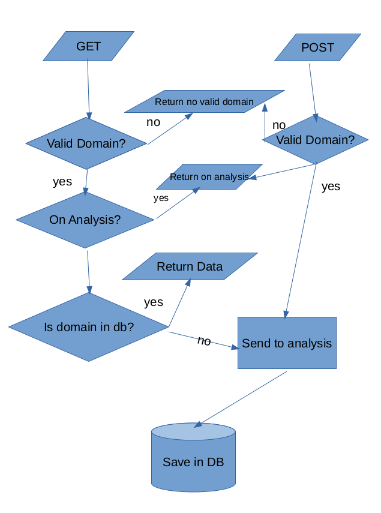

# intelligenter

## How to run?

```bash
git clone https://github.com/BetzalelKenig/intelligenter
```

```
cd intelligenter && npm install
```

### DB postgres on docker

```bash
docker run -p 8080:80 \
   -e 'PGADMIN_DEFAULT_EMAIL=a@a.com' \
   -e 'PGADMIN_DEFAULT_PASSWORD=123456' \
   -d dpage/pgadmin4

```

create .env file with the keys that are in config.ts file.

```bash
npm start
```



